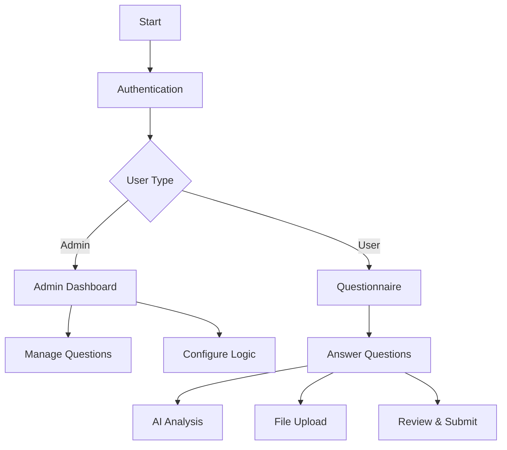
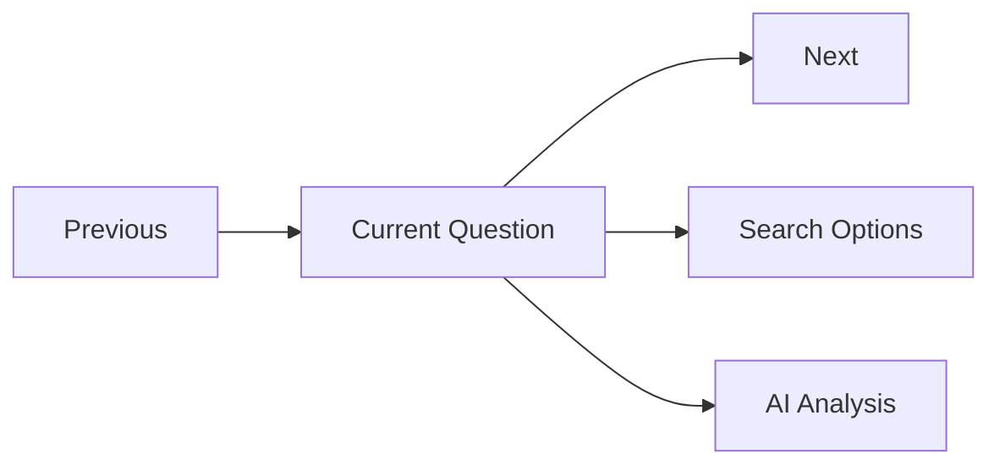
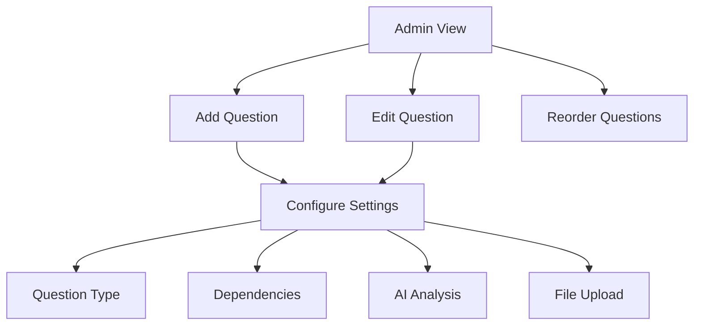

# AWS InCommunities Portal Demo v2 Documentation

## 🚀 Overview

The AWS InCommunities Portal is a dynamic questionnaire system designed to streamline the process of gathering and managing information about AWS infrastructure projects. The system features a user-friendly interface with advanced capabilities for both administrators and users.

## ✨ Key Features

### 📋 Dynamic Question Flow
- **Adaptive Navigation**: Questions presented in a logical sequence based on previous answers
- **Multiple Input Types**:
  - 📝 Multiple Choice Questions
  - ✍️ Text Input Fields
  - 📁 File Uploads with Metadata
  - 🔄 Repeatable Form Groups

### 🤖 AI Integration
- **Smart Analysis**: Real-time AI-powered analysis of responses
- **Custom Prompts**: Configurable AI prompts with dynamic content insertion
- **Instant Feedback**: Immediate AI-generated insights

### 📊 Administrative Features
- **Question Management**: Add, edit, and reorder questions with drag-and-drop
- **Logic Configuration**: Set up dependencies and conditional flows
- **File Upload Configuration**: Customize file requirements and metadata fields

## 📱 User Guide

### For Users

#### 1. Navigation

- Use "Next" to proceed ➡️
- Use "Back" to review ⬅️
- Search functionality for filtering options 🔍

#### 2. Question Types

##### Multiple Choice Questions
- Select from available options
- Search through options using the search bar
- View AI analysis of your selection

##### Text Input Questions
- Enter your response in the text field
- Character limits and validation where applicable
- Optional AI analysis of your input

##### File Upload Questions
- 📎 Drag and drop or click to upload
- Add metadata for each file
- Supported formats: JPEG, PNG, GIF, PDF
- Maximum file size: 50MB

##### Repeater Questions
- ➕ Add multiple entries
- Fill in all required fields
- Remove entries as needed
- Minimum/maximum entry limits apply

### For Administrators

#### 1. Question Management

- Access admin mode through the view switcher 🔄
- Add questions with the "+" button
- Drag and drop to reorder
- Click edit icon to modify text

#### 2. Configuration Options

##### Multiple Choice Setup
- Add/remove options
- Configure dependencies
- Set up conditional logic
- Enable AI analysis

##### File Upload Setup
- Enable/disable file uploads
- Set number of allowed files
- Configure metadata fields
- Set file type restrictions

##### AI Configuration
Available merge tags:

- **Current question text**
`{{question}}`
- **User's response**
`{{answer}}`
- **Previous answer**
`{{previousAnswer}}`

## 🛠️ Technical Details

### Data Storage
- Questions and responses stored in Supabase
- Secure file storage with access controls
- User settings and preferences persistence

### Security Features
- Role-based access control (User/Admin)
- Secure authentication
- Protected API endpoints
- Encrypted file storage

## 💡 Best Practices

### For Users
**1. Complete Information**
   - Provide detailed responses
   - Upload clear, relevant files
   - Review before submission

**2. File Management**
   - Use descriptive file names
   - Include required metadata
   - Verify file uploads

### For Administrators
**1. Question Design**
   - Write clear, concise questions
   - Provide sufficient options
   - Use logical dependencies

**2. AI Prompt Design**
   - Write specific prompts
   - Use all relevant merge tags
   - Test with various responses

## 🆘 Troubleshooting

### Common Issues

#### AI Analysis Not Working
✅ Solution:
1. Verify API key in settings
2. Check prompt configuration
3. Ensure AI is enabled for question

#### File Upload Issues
✅ Solution:
1. Check file size (max 50MB)
2. Verify file format
3. Complete all required metadata

#### Question Flow Problems
✅ Solution:
1. Review dependencies
2. Check logic settings
3. Verify question order

### Need Help?

Contact support through:
- 📧 Email: gerard@keeco.ie
- 💬 Chat: Available in portal